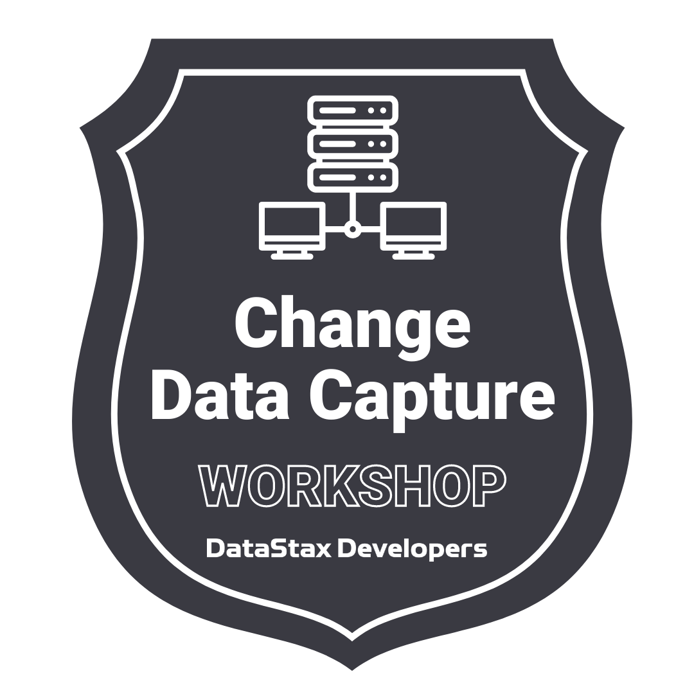

# 🔥🔥 Introduction to Event Stream Processing and Change Data Capture (CDC) 🔥🔥

Welcome to the 'Introduction to Event Stream Processing and Change Data Capture (CDC)' workshop. In this two-hour workshop, the Developer Advocate team of DataStax shows the most important fundamentals and basics of XXXXXX.

It doesn't matter if you join our workshop live or you prefer to do at your own pace, we have you covered. In this repository, you'll find everything you need for this workshop.

## Getting Started

Before you begin the workshop, you'll need a few things:

- Either the Java Runtime Environment(JRE) or Java Development Kit(JDK) installed
- Astra account with a saved payment method (it's ok, we won't go past free credits!)

## Workshop assets

- [Slide deck](slides/presentation.pdf)
- [Workshop video](https://www.youtube.com/watch?v=5lPKtPap6co)
- [Discord chat](https://dtsx.io/discord)
- [Questions and Answers](https://community.datastax.com/)

## Workshop Lab: Interacting with the Pulsar Broker

  1. Get familar with the Pulsar environment
  1. Pub/Sub
  1. Augmenting message text
  1. Filtering messages to other topics
  1. Adding a source connector

  First, open the lab environment: 

  Once the environment has initialized, *[start the lab](/lab1/get-familiar.md)*    

## Earning the workshop badge

To earn the badge for this workshop, you'll need to answer the [homework questions](https://forms.gle/BHGNPQXhdLRWbV7C8). Once submitted, we will evaluate your answers and you will receive an email with the badge certificate.

